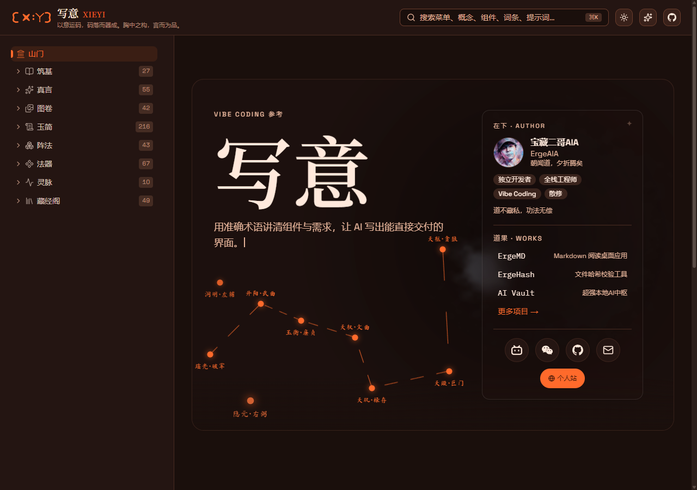

<!-- ===== 区块1：品牌开场 ===== -->
<!-- 打字机动画 + 身份标签 + 品牌语录 -->

 

`独立开发者` `全栈工程师` `产品经理` `Vibe Coding 实践者` `AI 绘画爱好者`

 

<!-- ===== 区块2：社交徽章 ===== -->
<!-- 使用 for-the-badge 风格，颜色与品牌色系一致 -->

 

<!-- ===== 区块3：个人简介 ===== -->

## 关于我

一个把复杂 AI 工具变成普通人生产力的人。

- 帮助普通人通过 AI 改变自己 —— **三无分享：无门槛、无套路、无保留**
- 目前专注：B 站 AI 内容创作 · 全平台自媒体运营 · AI 工具教程体系搭建
- 用 AI 编程工具驱动全栈开发，主力技术栈覆盖 Tauri / Rust / React / Python / ComfyUI
- 座右铭：**生命不息，折腾不止**

 

<!-- ===== 区块4：精选项目 ===== -->

## 精选项目

<!-- 使用 GitHub Actions 自动刷新星标和更新时间 -->

<table>
<tr>
<td width="50%">

### [AI Vault](https://ergeaia.github.io/aivault-site)

本地优先的 AI 创作者工作台：统一管理技能、提示词、MCP、ComfyUI 工作流，一键分发到 46+ Agent。

</td>
<td width="50%">

### [写意](https://ergeaia.github.io/xieyi/)

Vibe Coding 指南站点：专注产品设计、把实现交给 AI，落地为可浏览的组件库 + 概念库。

</td>
</tr>
<tr>
<td width="50%">

### [ErgeMD](https://github.com/ErgeAIA/ErgeMD)

基于 Tauri 2 + React 19 的 Markdown 桌面阅读器，主打极致渲染与丝滑阅读。

</td>
<td width="50%">

### [ErgeHash](https://github.com/ErgeAIA/ErgeHash)

跨平台文件哈希校验工具（Tauri 2 + Rust + React），本地优先、零上传、极速批量校验。

</td>
</tr>
<tr>
<td width="50%">

### [catapult-cn](https://github.com/ErgeAIA/catapult-cn)

基于 Tauri v2 的 llama.cpp 桌面启动器 —— 无需命令行，从零开始本地大模型对话。

</td>
<td width="50%">

### [claude-code-bootstrap](https://github.com/ErgeAIA/claude-code-bootstrap)

一键拉起 Claude Code 工作环境（Windows PowerShell），可选部署 hooks 工作流。

</td>
</tr>
</table>

 

<!-- ===== 区块5：数据 ===== -->
<!-- 三联卡：统计 / 仓库语言 / 提交语言（语言用甜甜圈图，比横向条形更易读） -->

## 📊 数据

 

<!-- ===== 区块6：技能与工具 ===== -->
<!-- 技术栈用 skillicons 图标墙；AI 工具 skillicons 未收录，保留 shields.io 徽章 -->

## 🛠️ 技能与工具

**技术栈**

 

**AI 工具**

 

<!-- ===== 区块7：GitHub 活动 ===== -->
<!-- 贪吃蛇贡献图：由 .github/workflows/snake.yml 定时生成并推送到 dist 分支 -->
<!-- 用 <picture> 跟随 GitHub 深/浅色主题切换；配色取自 opensquilla/ember 主题 -->

## 🐍 GitHub 活动

<picture>
  <source media="(prefers-color-scheme: dark)" srcset="https://raw.githubusercontent.com/ErgeAIA/ErgeAIA/dist/github-contribution-grid-snake-dark.svg">
  <source media="(prefers-color-scheme: light)" srcset="https://raw.githubusercontent.com/ErgeAIA/ErgeAIA/dist/github-contribution-grid-snake.svg">
  
</picture>

 

<!-- ===== 区块8：写意 ===== -->
<!-- 整站截图当封面：读者不点进去也能看到站点长什么样 -->

## 📝 写意 · Vibe Coding 参考

  

**[写意 Xieyi](https://ergeaia.github.io/xieyi/)** —— 以意运码，码落而器成 
用准确术语讲清组件与需求，让 AI 写出能直接交付的界面  
概念 27 · 提示词 55 · 组件 67 · 词条 216 · 示例 42  

 

<!-- ===== 区块9：座右铭 / 品牌语录 ===== -->

> *"我走过的弯路，你不必再走！"*
>
> —— 宝藏二哥AIA

 

<!-- ===== 区块10：访问计数 ===== -->

---

<!-- ===== 占位符清单（方便后续修改） ===== -->
<!-- 待替换占位符：
  {用户名}          → ErgeAIA
  {称呼}            → 宝藏二哥AIA
  {身份标签}        → 独立开发者 / 全栈工程师 / AI绘画爱好者
  {B站链接}         → https://space.bilibili.com/67221461
  {知乎链接}        → https://www.zhihu.com/people/meli55a/posts
  {公众号名称}      → 宝藏二哥AIA
  {邮箱}            → ergeaia@gmail.com
  {项目1链接}       → https://ergeaia.github.io/aivault-site
  {项目2链接}       → https://ergeaia.github.io/xieyi/
  {项目3链接}       → https://github.com/ErgeAIA/ErgeMD
  {项目4链接}       → https://github.com/ErgeAIA/ErgeHash
  {项目5链接}       → https://github.com/ErgeAIA/catapult-cn
  {项目6链接}       → https://github.com/ErgeAIA/claude-code-bootstrap
  {品牌语录}        → "我走过的弯路，你不必再走！"
  {座右铭}          → "生命不息，折腾不止"
  {Slogan}          → "AI 不该有门槛" / "把AI从天边拉到手边"

  维护提示：
  - 区块5 数据卡 / 区块6 图标墙 / 区块7 贪吃蛇 均由外部服务或定时任务生成，改 URL 时先实测能否渲染
  - 区块6 技术栈图标 id 必须逐个验证（skillicons 对未收录的 id 会静默不渲染）
  - 区块7 贪吃蛇首次启用需手动触发 .github/workflows/snake.yml，dist 分支生成后图片才生效
  - 区块8 的 assets/xieyi-preview.png 需站点改版后手动重新截图
  - 区块8 的内容数字（概念/提示词/组件/词条/示例）随站点更新会过期
-->
